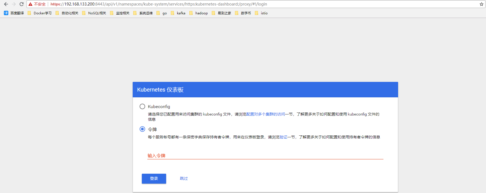

# 11.核心组件安装之 dashboard
#### 准备相关文件
将下载的 kubernetes-server-linux-amd64.tar.gz 解压后，再解压其中的 kubernetes-src.tar.gz 文件。dashboard 对应的目录是：
```
$ cd ~/kubernetes
$ tar zxf kubernetes-src.tar.gz
$ cd cluster/addons/dashboard/ && ll
总用量 32
-rw-rw-r--. 1 root root  264 12月  1 07:40 dashboard-configmap.yaml
-rw-rw-r--. 1 root root 1817 12月  6 22:47 dashboard-controller.yaml
-rw-rw-r--. 1 root root 1353 12月  1 07:40 dashboard-rbac.yaml
-rw-rw-r--. 1 root root  551 12月  1 07:40 dashboard-secret.yaml
-rw-rw-r--. 1 root root  322 12月  1 07:40 dashboard-service.yaml
-rw-rw-r--. 1 root root  242 12月  1 07:40 MAINTAINERS.md
-rw-rw-r--. 1 root root  125 12月  1 07:40 OWNERS
-rw-rw-r--. 1 root root  400 12月  1 07:40 README.md
```
#### 修改yml中的镜像
```
$ grep "k8s.gcr.io" dashboard-controller.yaml 
        image: k8s.gcr.io/kubernetes-dashboard-amd64:v1.8.3
$ sed -i 's#k8s.gcr.io#hexun#' dashboard-controller.yaml 
$ grep "image" dashboard-controller.yaml 
        image: hexun/kubernetes-dashboard-amd64:v1.8.3

$ cat > dashboard-service.yaml <<EOF 

apiVersion: v1
kind: Service
metadata:
  name: kubernetes-dashboard
  namespace: kube-system
  labels:
    k8s-app: kubernetes-dashboard
    kubernetes.io/cluster-service: "true"
    addonmanager.kubernetes.io/mode: Reconcile
spec:
  type: NodePort
  selector:
    k8s-app: kubernetes-dashboard
  ports:
  - port: 443
    targetPort: 8443
    nodePort: 30000
    protocol: TCP
EOF
```
#### 执行所定义的文件
```
$ kubectl create -f  .
```
#### 查看dashboard运行情况
```
$ kubectl get deployment kubernetes-dashboard  -n kube-system
NAME                   DESIRED   CURRENT   UP-TO-DATE   AVAILABLE   AGE
kubernetes-dashboard   1         1         1            1           1d
$ kubectl --namespace kube-system get pods -o wide |grep "dashboard"
kubernetes-dashboard-677bd5f589-7kvww            1/1     Running   0          15d   172.20.4.6     172.17.80.29   <none>
$ kubectl get services kubernetes-dashboard -n kube-system
NAME                   TYPE       CLUSTER-IP       EXTERNAL-IP   PORT(S)         AGE
kubernetes-dashboard   NodePort   10.254.197.170   <none>        443:30000/TCP   39s
```
从上面可以看出这里我们使用 `NodePort` 的方式暴露端口，来达到访问 dashboard 的目的。dashboard 的 --authentication-mode 支持 token以及basic，默认为 token。如果使用 basic，则 kube-apiserver 必须配置 '--authorization-mode=ABAC' 和 '--basic-auth-file' 参数。
#### 访问 dashboard
当前访问dashboard方式总结如下：
 + NodePort方式，不建议在生产环境（如果被攻击，你所有的应用将面临巨大的危险）;
 + kube proxy方式，但是只能在localhosts 和 127.0.0.1 下访问，限制略大以及配置起来麻烦;
 + kube-apiserver方式，我这里就是使用这种方式;
 + ingress 方式进行代理，这个后续实现;
通过kube-apiserver方式，首先查看集群信息：
```
$ kubectl cluster-info
Kubernetes master is running at https://192.168.133.200:8443
CoreDNS is running at https://192.168.133.200:8443/api/v1/namespaces/kube-system/services/kube-dns:dns/proxy
kubernetes-dashboard is running at https://192.168.133.200:8443/api/v1/namespaces/kube-system/services/https:kubernetes-dashboard:/proxy

To further debug and diagnose cluster problems, use 'kubectl cluster-info dump'.
```
初次尝试访问，https://192.168.133.200:8443/api/v1/namespaces/kube-system/services/https:kubernetes-dashboard:/proxy ,提示证书已信任，但是出现401错误
.png)

我们需要给浏览器生成一个 client 证书，访问 apiserver 的 6443 https 端口时使用。
这里使用部署 kubectl 命令行工具时创建的 admin 证书、私钥和上面的 ca 证书，创建一个浏览器可以使用 PKCS#12/PFX 格式的证书：
```
$ openssl pkcs12 -export -out admin.pfx -inkey admin-key.pem -in admin.pem -certfile ca.pem
```
将创建的 admin.pfx 导入到浏览器中。对于chrome，操作如下：
.png)
跟着一布一步操作，导入即可看到如下所示
.png)
然后重启浏览器，再次访问 https://192.168.133.200:8443/api/v1/namespaces/kube-system/services/https:kubernetes-dashboard:/proxy ,此时会提示选择一个浏览器证书，这里选中上面导入的 admin.pfx

####  创建登录 Dashboard 的 token
```
$ kubectl create sa dashboard-admin -n kube-system
$ kubectl create clusterrolebinding dashboard-admin --clusterrole=cluster-admin --serviceaccount=kube-system:dashboard-admin
$ ADMIN_SECRET=$(kubectl get secrets -n kube-system | grep dashboard-admin | awk '{print $1}')
$ DASHBOARD_LOGIN_TOKEN=$(kubectl describe secret -n kube-system ${ADMIN_SECRET} | grep -E '^token' | awk '{print $2}')
$ echo ${DASHBOARD_LOGIN_TOKEN}
```
通过token直接访问即可;
