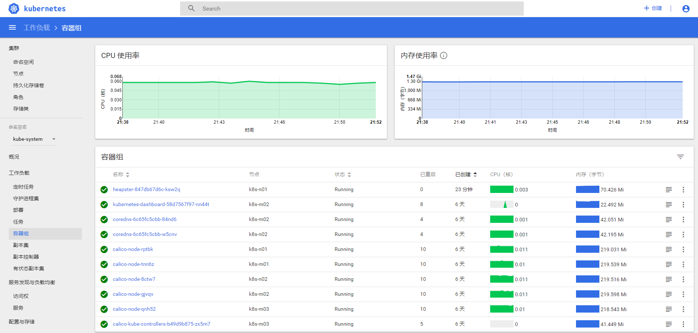

# 12.核心组件安装之 Heapster
Heapster是一个收集者，将每个Node上的cAdvisor的数据进行汇总，然后导到第三方工具(如InfluxDB)。Heapster 是通过调用 kubelet 的 http API 来获取 cAdvisor 的 metrics 数据的。

由于 kublet 只在 10250 端口接收 https 请求(我这里不使用https采集)，故需要修改 heapster 的 deployment 配置。同时，需要赋予 kube-system:heapster ServiceAccount 调用 kubelet API 的权限。

#### 准备相关文件
将下载的 kubernetes-server-linux-amd64.tar.gz 解压后，再解压其中的 kubernetes-src.tar.gz 文件。heapster 对应的目录是：
```
cd ~/kubernetes/cluster/addons/cluster-monitoring/
ls standalone/
heapster-controller.yaml  heapster-service.yaml
```
#### 修改yml中的镜像
```
$ grep "k8s.gcr.io" standalone/heapster-controller.yaml 
        - image: k8s.gcr.io/heapster-amd64:v1.5.3
        - image: k8s.gcr.io/addon-resizer:1.8.1
$ sed -i 's#image: k8s.gcr.io/heapster-amd64:v1.5.3#image: hexun/heapster-amd64:v1.5.3#' heapster-controller.yaml
$ sed -i 's#image: k8s.gcr.io/addon-resizer:1.8.1#image: hexun/addon-resizer:1.8.1#' heapster-controller.yaml
$ grep "image" heapster-controller.yaml
        - image: hexun/heapster-amd64:v1.5.3
        - image: hexun/addon-resizer:1.8.1
```
#### 部署 heapster
```
kubectl create -f  ./heapster-rbac.yaml
kubectl create -f  ./standalone/heapster-controller.yaml
```
提示：
我这里不需要通过 heapster 进行 k8s 集群监控，单纯只是为了 dashborad 出现图形，所以不需要部署 heapster-service 服务;
#### 查看 heapster 运行情况
```
$ kubectl get deployment heapster  -n kube-system
NAME       DESIRED   CURRENT   UP-TO-DATE   AVAILABLE   AGE
heapster   1         1         1            1           37m
```
#### 错误及解决方案
如果 kubelet 开启 https 认证，那么可能会出现如下问题：
```
W0806 07:15:25.000760       1 manager.go:152] Failed to get all responses in time (got 0/2)
E0806 07:16:05.022480       1 manager.go:101] Error in scraping containers from kubelet:192.168.57.111:10250: failed to get all container stats from Kubelet URL "https://192.168.57.111:10250/stats/container/": Post https://192.168.57.111:10250/stats/container/: x509: cannot validate certificate for 192.168.133.128 because it doesn't contain any IP SANs
E0806 07:16:05.025979       1 manager.go:101] Error in scraping containers from kubelet:192.168.57.112:10250: failed to get all container stats from Kubelet URL "https://192.168.57.112:10250/stats/container/": Post https://192.168.57.112:10250/stats/container/: x509: cannot validate certificate for 192.168.133.129 because it doesn't contain any IP SANs
......
```
我的解决方案目前如下：
+ 一、通过修改 kubelet 配置，还是修改为 http 认证;
```
  "readOnlyPort": 10255,
  "port": 10250,
```
+ 二、删除/etc/kubernetes/ssl/kubelet-*，重启 kubelet;

具体采用哪一种，根据自己的环境决定。如果有更好的方案，可以与我联系交流一起学习。
#### 最终效果
检查 kubernets dashboard 界面，可以正确显示各 Nodes、Pods 的 CPU、内存、负载等统计数据和图表：

